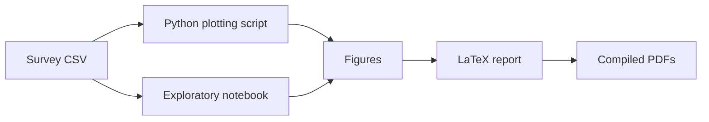

# MA4240 Applied Statistics

Applied statistics project analyzing meal-skipping behavior among IITH students. The repository keeps the survey data, plotting code, generated figures, notebooks, and LaTeX reports together so the analysis can be reviewed or regenerated.

## Analysis Workflow



## Repository Layout

| Path | Purpose |
| --- | --- |
| `data/` | Survey dataset. |
| `src/plots.py` | Plot-generation script. |
| `notebooks/` | Notebook used for exploratory figure generation. |
| `figures/` | Generated plots used in reports. |
| `docs/reports/` | LaTeX sources and compiled PDFs. |

## Reproducing Figures

```bash
cd MA4240
python src/plots.py
```

The script expects the survey CSV in `data/`. Generated figures should be written to, or copied into, `figures/`.

## Reports

- `docs/reports/main.tex`
- `docs/reports/main_report.tex`
- `docs/reports/stats_presentation.tex`

Build the LaTeX files with your preferred TeX distribution if you need to regenerate the PDFs.
