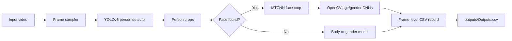

# Bosch Age and Gender Detection

Computer-vision prototype for detecting people in CCTV/video frames and estimating age and gender from face/body crops. The code combines YOLOv5 person detection, MTCNN face detection, OpenCV DNN age/gender classifiers, and a body-to-gender fallback model.

## Pipeline Diagram



## Repository Layout

| Path | Purpose |
| --- | --- |
| `src/bosch_age_gender/` | Inference and video utility scripts. |
| `notebooks/` | Original Inter-IIT exploratory notebook. |
| `models/` | Retained checkpoint and expected location for Caffe/body2gender model files. |
| `media/samples/` | Sample videos used by demos. |
| `outputs/` | Runtime CSV output directory, ignored by Git. |

## Requirements

The original environment used:

- Python 3.8.8
- PyTorch 1.11.0
- TensorFlow 2.8.0
- OpenCV 4.5.1.48
- NumPy 1.22.3
- `mtcnn` 0.1.1

Install from the pinned dependency file:

```bash
cd bosch-age-gender
python -m venv .venv
.venv\Scripts\activate
pip install -r requirements.txt
```

## Usage

Run the main inference script from the project root:

```bash
$env:PYTHONPATH = "src"
python -m bosch_age_gender.infer_age_gender --file "media/samples/reservation.mp4" --fr_rate 5
```

`--fr_rate` controls frame sampling. For example, `--fr_rate 5` processes every fifth frame. Results are written to `outputs/Outputs.csv`.

## Model Artifacts

The script expects these model files under `models/` when running the full age/gender path:

- `age_deploy.prototxt`
- `age_net.caffemodel`
- `gender_deploy.prototxt`
- `dump.caffemodel`
- `body2gen/model.h5`

Only artifacts present in the source folder were committed. Add missing model files locally before running the full pipeline.

## Utility Scripts

- `capture.py` displays the sample video with OpenCV.
- `yolo_video_batch.py` batches frames through YOLOv5 for person detection analysis.
- `person_crop_demo.py` visualizes person crops and bounding boxes.
