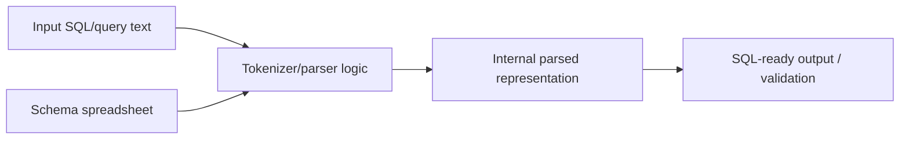

# DBMS II Parser Experiments

C++ database-systems project containing parser experiments and SQL-ready parsing utilities. The code is intentionally lightweight: a shared header, parser implementations, a test driver, and a schema spreadsheet used as project data.

## Flow Diagram



## Repository Layout

| Path | Purpose |
| --- | --- |
| `src/header.h` | Shared declarations and data structures. |
| `src/parser.cpp` | Main parser implementation. |
| `src/parse_sqlready.cpp` | SQL-ready parsing variant. |
| `tests/test.cpp` | Test/driver source. |
| `data/DBMS_Group_3_Schema.xlsx` | Schema/reference spreadsheet. |

## Build

Compile with a modern C++ compiler from the project root.

```bash
cd dbms2
g++ -std=c++17 src/parser.cpp -o parser
g++ -std=c++17 src/parse_sqlready.cpp -o parse_sqlready
```

If `tests/test.cpp` depends on parser symbols directly, compile it together with the relevant implementation file.

```bash
g++ -std=c++17 tests/test.cpp src/parser.cpp -o parser_test
```

## Notes

- There is no CMake project yet; add one if this grows beyond the current parser experiments.
- The spreadsheet in `data/` should be treated as project input/reference material, not generated output.
