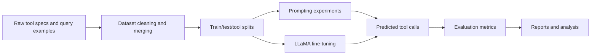

# DevRev Tools RAG

Retrieval and generation experiments for selecting DevRev-style tools from natural-language requests. The repository contains curated tool/query datasets, zero-shot and few-shot experiment notebooks, LLaMA fine-tuning code, and evaluation scripts for measuring tool-selection quality and hallucination behavior.

## What This Contains

- Dataset construction and merged tool/query examples under `data/`.
- Prompting experiments under `experiments/`.
- Fine-tuning and LLM experiment code under `src/`.
- Evaluation scripts under `evaluation/`.
- Written reports and presentation material under `docs/report/`.

## System Diagram



## Repository Layout

| Path | Purpose |
| --- | --- |
| `data/` | Raw, augmented, merged, and split JSON/CSV datasets. |
| `data/gpt_prompts/` | Prompt templates used to generate or evaluate examples. |
| `experiments/` | Zero-shot and few-shot notebooks. |
| `src/llama_finetuning/` | Dataset, train, predict, and main scripts for fine-tuning. |
| `src/llms/` | LLM-specific exploratory code and reference paper assets. |
| `evaluation/` | Metric and GPT-4 evaluation scripts. |
| `docs/report/` | LaTeX reports, PDFs, and bibliography assets. |

## Typical Workflow

1. Inspect or update tool/query examples in `data/`.
2. Build or reuse split files from `data/dataset_splits/`.
3. Run a notebook in `experiments/` for prompting baselines, or run scripts in `src/llama_finetuning/` for model training.
4. Evaluate predictions with scripts in `evaluation/`.
5. Record results in `docs/report/`.

## Running Experiments

The project is notebook and script driven. Create an isolated Python environment, install the dependencies required by the notebook or script you are running, then execute from the project root so relative `data/` paths resolve cleanly.

```bash
cd devrev-tools-rag
python -m venv .venv
.venv\Scripts\activate
python src/llama_finetuning/main.py
```

Adjust the command above to the specific experiment file you are reproducing.

## Notes

- Some file and folder names preserve the original experiment naming, including typos such as `Augumented` and `halucination`, because notebooks and reports may refer to those paths.
- The reports in `docs/report/` are the best high-level reference for experiment motivation and results.
