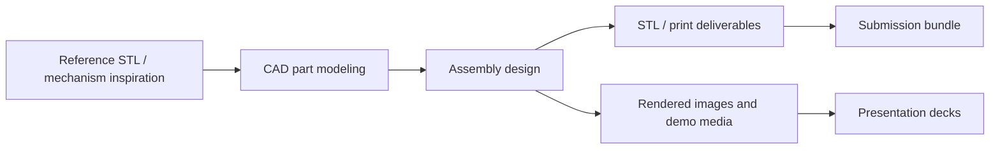

# DigiFab Planetarium Mechanism

Digital fabrication archive for a mechanical planetarium-style assembly. The repository contains Solid Edge CAD parts, STL inspiration/reference files, rendered images, demonstration media, presentation decks, and zipped submission bundles.

## Fabrication Workflow

## Repository Layout

| Path | Purpose |
| --- | --- |
| `assets/cad-project/` | Solid Edge parts, assemblies, configurations, and planet models. |
| `assets/inspiration-files/` | Reference STL/OpenSCAD files used for inspiration. |
| `deliverables/` | Zipped parts and STL/print bundles. |
| `docs/presentations/` | Project presentation decks. |
| `media/images/` | Tray and estimate images. |
| `media/videos/` | Assembly GIF/video demos. |

## How To Use

Open `.par`, `.asm`, and `.cfg` files with Solid Edge or a compatible CAD tool. Use the ZIP files in `deliverables/` for packaged submission assets, and use `docs/presentations/` for the final project narrative.

## Contributors

- Vikhyath
- Tanmay Garg
- Anirudh
- Ojjas
- Aman
