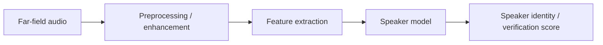

# Far-Field Speaker Recognition

Report archive for a far-field speaker-recognition project. Source code was not available in the imported folder, so this directory preserves the technical report and slide deck.

## Conceptual System

## Repository Layout

| Path | Purpose |
| --- | --- |
| `docs/technical_report.pdf` | Main technical report. |
| `docs/slides.pdf` | Presentation slide deck. |

## How To Use

Open the PDFs in `docs/` to review the methodology and results. No runnable implementation was present in the source material.
