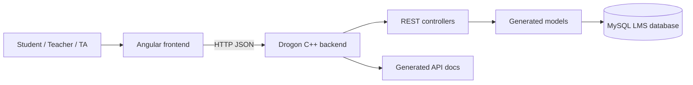
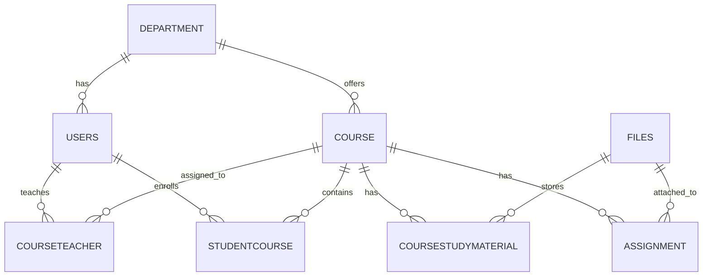

# Learning Management System

A full-stack LMS prototype for teachers, students, and teaching assistants. The system includes an Angular client, a C++ Drogon REST backend, MySQL schema/model code, generated API documentation, and static HTML prototypes from the design phase.

## Features

- Student course registration and course-material browsing.
- Assignment and study-material workflows.
- Teacher-side course, assignment, file, and enrollment management.
- Generated REST controllers and ORM-style models for LMS entities.
- Static HTML prototypes for early UI flows.

## System Diagram



## Data Model



## Repository Layout

| Path | Purpose |
| --- | --- |
| `backend/` | Drogon backend, controllers, models, schema, and CMake build file. |
| `frontend/` | Angular 12 client. |
| `prototypes/static-html/` | Static HTML screens used during UI design. |
| `docs/generated/` | Generated API/model documentation and project spreadsheet. |

## Backend Setup

Install Drogon and MySQL client dependencies, create the database from `backend/lms.sql`, then build with CMake.

```bash
cd learning-management-system/backend
cmake -S . -B build
cmake --build build
```

Check `backend/config.json` before running to confirm database connection settings.

## Frontend Setup

```bash
cd learning-management-system/frontend
npm install
npm start
```

The Angular development server starts the client. Configure API base URLs in the frontend source if the Drogon server runs on a non-default host or port.

## API Surface

The backend exposes CRUD-style routes for the generated LMS resources:

- `/users`
- `/department`
- `/course`
- `/courseteacher`
- `/studentcourse`
- `/coursestudymaterial`
- `/assignment`
- `/files`

Generated controller/model documentation is available in `docs/generated/html/`.
