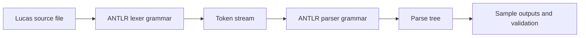

# Lucas Compiler Project

Lucas is a compiled, statically typed, object-based language designed for programmers who need calculus-oriented features and arbitrary-precision integers in a simple academic language. This repository contains the language specification, ANTLR lexer/parser grammars, test cases, documentation, and final presentation material.

## Compiler Front-End Diagram



## Repository Layout

| Path | Purpose |
| --- | --- |
| `src/lexer/` | Lexer grammar, makefile, test cases, ANTLR jar, and lexer documentation. |
| `src/parser/` | Parser grammar, makefile, parser test cases, and sample parse-tree outputs. |
| `docs/` | Language specification. |
| `media/final-presentation-and-video/` | Final report, deck, language document, and demo video. |

## Language Highlights

- Statically typed and object based.
- Block labels inspired by LaTeX-style `begin`/`end` structure.
- Arbitrary precision integer type (`bigint`).
- Multiple return values.
- Calculus-oriented design goals for differentials, integrals, and future math packages.

## Build / Run

Each front-end stage keeps its own makefile. Start with the lexer, then parser.

```bash
cd lucas/src/lexer
make
```

```bash
cd lucas/src/parser
make
```

The ANTLR runtime jar is retained in each source folder for reproducibility with the original project setup.

## Documentation

- `docs/Team-3_language_specification.pdf`
- `src/lexer/documentation/The Lucas Lexer.pdf`
- `src/parser/Documentation/The Lucas Parser.pdf`
- `media/final-presentation-and-video/Team 3 - Final Report.pdf`
