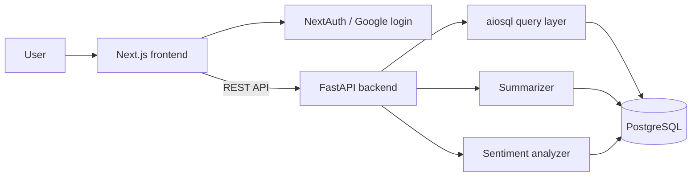

# Movie Review System

A full-stack movie-review application built for the MILAN Sentiforge hackathon. The app combines a Next.js frontend, a FastAPI backend, PostgreSQL storage, Google-authenticated review submission, and ML modules for sentiment analysis and review summarization.

## Features

- Browse, search, and sort movies.
- View movie details and reviews.
- Add and delete authenticated reviews.
- Store movie metadata, summaries, ratings, and review sentiment in PostgreSQL.
- Run summarization and sentiment-analysis utilities from the `ml/` modules.

## System Diagram



## Repository Layout

| Path | Purpose |
| --- | --- |
| `frontend/` | Next.js 13 client, NextAuth configuration, and UI components. |
| `backend/` | FastAPI service, SQL schema, SQL queries, auth utilities, and DB initialization. |
| `ml/` | Standalone sentiment and summarization modules. |
| `research/` | Scraping and EDA notebooks/scripts. |
| `docs/` | Report and presentation deliverables. |

## Backend Setup

```bash
cd movie-review-system/backend
poetry install
poetry run uvicorn backend.main:app --reload
```

Create a backend environment file from `backend/backend/env.example`, configure PostgreSQL, then initialize the database using files in `backend/init_db/`.

## Frontend Setup

```bash
cd movie-review-system/frontend
yarn install
npm run dev
```

Create `.env.local` from `frontend/env.example` and configure the backend URL plus NextAuth/Google credentials.

## API Summary

| Method | Path | Purpose |
| --- | --- | --- |
| `GET` | `/names` | Return movie IDs and titles for autocomplete. |
| `GET` | `/search?q=...` | Search movies by title. |
| `GET` | `/movies` | List movies with sorting and pagination. |
| `GET` | `/movies/{movie_id}` | Return full movie details. |
| `GET` | `/movies/{movie_id}/reviews` | List reviews for a movie. |
| `POST` | `/movies/{movie_id}/reviews` | Create an authenticated review. |
| `DELETE` | `/movies/{movie_id}/reviews/{review_id}` | Delete an owned review. |

## ML Modules

- `ml/Sentiment/` contains sentiment inference utilities.
- `ml/Summarizer/` contains abstractive summarization utilities and model loading code.
- The original README expected an external model directory; keep downloaded model artifacts out of Git unless they are small and reproducible.
