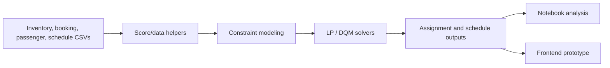

# Mphasis Quantum Flight Scheduling

Inter-IIT 2023 mid-preparation project for quantum-inspired flight scheduling. The repository combines dataset parsing, scoring helpers, linear/integer programming experiments, DQM formulation notes, notebooks, and a frontend prototype.

## System Diagram



## Repository Layout

| Path | Purpose |
| --- | --- |
| `src/` | Optimization scripts, DQM constraints, and mail/helper utilities. |
| `data/scores/` | CSV inputs, data descriptions, rules, and scoring helper classes. |
| `notebooks/` | Exploratory and final notebooks. |
| `lp/` | Linear-programming notes and generated PDF/TeX artifacts. |
| `backend/` | Backend prototype assets. |
| `frontend/` | UI prototype. |

## Data Inputs

Primary inputs live in `data/scores/Data/`:

- `Inventory.csv`
- `PNR_Booking.csv`
- `PNR_Passenger.csv`
- `Schedule.csv`
- `Rule_Set_List.pdf`
- `Data_Description.pdf`

## Running Analysis

Use a Python environment with the optimization/data libraries required by the script or notebook you are running.

```bash
cd mphasis-quantum-flight-scheduling
python src/lp.py
python src/dqm_constraints.py
```

For reproducible exploration, start from `notebooks/final.ipynb` or `notebooks/final_r.ipynb`.

## Frontend Prototype

```bash
cd mphasis-quantum-flight-scheduling/frontend
npm install
npm run dev
```

Check `frontend/package.json` for the exact scripts supported by the prototype.
