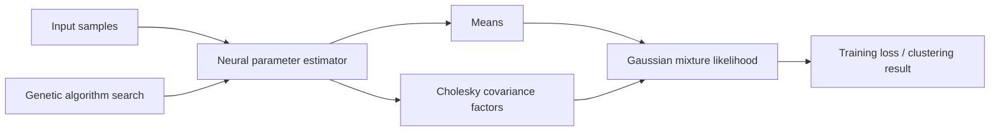

# Neuro-Gaussian Mixture Model

Research experiments that combine neural networks with Gaussian Mixture Models. The central idea is to predict GMM parameters with a neural model while enforcing valid covariance matrices through Cholesky-style parameterization.

## Model Diagram



## Repository Layout

| Path | Purpose |
| --- | --- |
| `src/neuro_gmm/` | NGMM and FIGM implementation scripts. |
| `notebooks/` | Experiment notebooks. |
| `docs/` | Project report, literature survey, and presentation material. |
| `requirements.txt` | Python dependencies captured from the original project. |

## Setup

```bash
cd neuro-GMM
python -m venv .venv
.venv\Scripts\activate
pip install -r requirements.txt
```

## Usage

Run scripts from the project root with `src` on `PYTHONPATH`.

```bash
$env:PYTHONPATH = "src"
python src/neuro_gmm/ngmm.py
python src/neuro_gmm/figm.py
```

For exploratory reproduction, start with the notebooks in `notebooks/`.

## Concepts

- Neural prediction of mixture means and covariance parameters.
- Positive-definite covariance construction through Cholesky factors.
- Genetic algorithm search for architecture or hyperparameter choices.
- Comparison against classical GMM and fuzzy clustering baselines.

## Contributors

- [@anirudh-srini](https://github.com/anirudh-srini)
- [@Flash1020](https://github.com/Flash1020)
