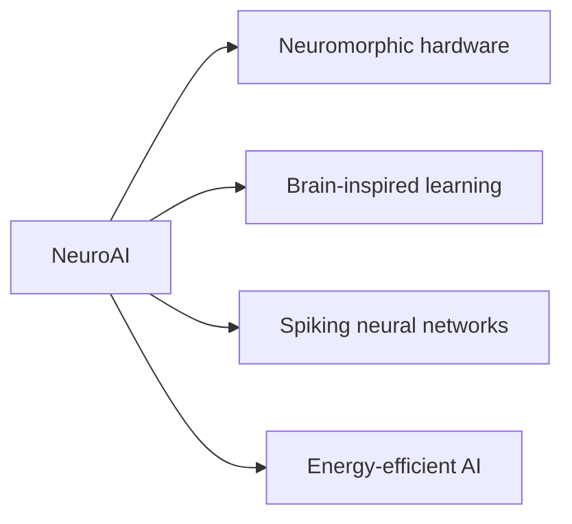

# NeuroAI Survey

Archive for a neuromorphic AI survey paper. No implementation code was available in the imported folder.

## Topic Map

## Repository Layout

| Path | Purpose |
| --- | --- |
| `docs/neuromorphic_AI_survey.pdf` | Survey paper. |

## How To Use

Read the PDF in `docs/` for the survey content. This folder is intentionally documentation-only.
