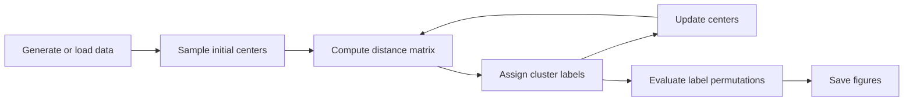

# Quantum Spherical K-Means

Python experiments for spherical k-means and quantum-inspired distance combinations. The project compares Euclidean distance, cosine similarity, and a linear combination of both while sweeping hyperparameters and visualizing clustering quality.

## System Diagram



## Repository Layout

| Path | Purpose |
| --- | --- |
| `src/quantum_spherical_kmeans/` | Reusable clustering implementation and experiment entrypoint. |
| `notebooks/` | Exploratory qMeans and algorithm notebooks. |
| `figures/` | Generated clustering and contour plots. |
| `docs/` | Project report PDF. |
| `scripts/` | Shell runner scripts. |

## Setup

Create a Python environment with NumPy, SciPy, scikit-learn, matplotlib, and tqdm.

```bash
cd quantum-spherical-kmeans
python -m venv .venv
.venv\Scripts\activate
pip install numpy scipy scikit-learn matplotlib tqdm
```

## Usage

Run the module from the project root so `figures/` output paths resolve.

```bash
python -m quantum_spherical_kmeans.main --scatter_plot --random_state 1
python -m quantum_spherical_kmeans.main --contour_plot --random_state 1
```

If Python cannot find the package, set `PYTHONPATH` to the local `src` directory.

```bash
$env:PYTHONPATH = "src"
python -m quantum_spherical_kmeans.main --contour_plot
```

## Notes

- `SKMeans` is implemented in `src/quantum_spherical_kmeans/skmeans.py`.
- Distance helpers live in `src/quantum_spherical_kmeans/distance_metric.py`.
- The report in `docs/` provides the theoretical background for the qMeans experiments.
