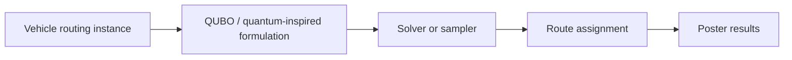

# Quantum VRP

Poster archive for a quantum vehicle-routing project. No runnable implementation was available in the imported folder.

## Conceptual Workflow

## Repository Layout

| Path | Purpose |
| --- | --- |
| `docs/Quantum_VRP_Poster.pdf` | Project poster. |

## How To Use

Open the poster in `docs/` to review the problem formulation and project summary. This folder is intentionally documentation-only.
