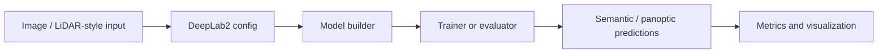

# Segmentation LiDAR

LiDAR and scene-segmentation experiments based on the DeepLab2 research codebase. The upstream-style `deeplab2/` tree is intentionally kept intact so imports, configs, demo notebooks, evaluation utilities, and test data continue to work together.

## Pipeline Diagram

## Repository Layout

| Path | Purpose |
| --- | --- |
| `deeplab2/` | Main DeepLab2 code, configs, demos, trainer, evaluator, model code, and test data. |
| `deeplab2/DeepLab_Cityscapes_Demo.ipynb` | Cityscapes demo notebook. |
| `deeplab2/ViP_DeepLab_Demo.ipynb` | ViP-DeepLab demo notebook. |
| `deeplab2/evaluation/` | Evaluation code and test data. |
| `deeplab2/trainer/` | Training/evaluation runners. |

## Getting Started

Start from the upstream README at `deeplab2/README.md`. It contains the dependency and dataset assumptions for the DeepLab2 codebase.

## Notes

- This project was not aggressively repackaged because DeepLab2 uses package-relative imports and many internal paths.
- Generated caches and nested Git metadata were removed, but research-code layout was preserved.
