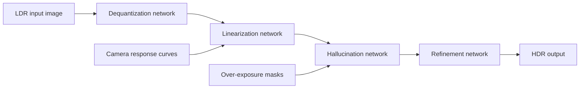

# Single-Image HDR Reconstruction

Reference-style TensorFlow implementation and assets for "Single-Image HDR Reconstruction by Learning to Reverse the Camera Pipeline" (CVPR 2020). The method decomposes LDR-to-HDR recovery into inverse quantization, inverse camera response linearization, hallucination of saturated regions, and optional refinement.

## Method Diagram



## Repository Layout

| Path | Purpose |
| --- | --- |
| `src/single_hdr/` | Inference/model utility scripts. |
| `training_code/` | Original training pipeline and training README. |
| `data/` | Response curves, masks, and support data. |
| `tf_records/` | TFRecord training inputs retained from the source package. |
| `assets/images/` | Paper and README images. |
| `assets/sample-inputs/` | Example input images. |
| `docs/site/` and `docs/website/` | Project page assets and visual results. |

## Requirements

The original implementation was tested with TensorFlow 1.10.0. Use an isolated legacy environment if you need to reproduce results exactly.

## Inference

Run from the project root after adding the pretrained checkpoints locally.

```bash
$env:PYTHONPATH = "src"
python -m single_hdr.test_real ^
  --ckpt_path_deq ckpt_deq/model.ckpt ^
  --ckpt_path_lin ckpt_lin/model.ckpt ^
  --ckpt_path_hal ckpt_hal/model.ckpt ^
  --test_imgs assets/sample-inputs ^
  --output_path output_hdrs
```

For the refined model:

```bash
$env:PYTHONPATH = "src"
python -m single_hdr.test_real_refinement ^
  --ckpt_path ckpt_deq_lin_hal_ref/model.ckpt ^
  --test_imgs assets/sample-inputs ^
  --output_path output_hdrs
```

## Training

See `training_code/README.md` for the original training instructions and dataset preparation steps.

## External Resources

The original README referenced external project, dataset, and checkpoint links. Keep downloaded datasets and checkpoints outside Git unless they are small and reproducible.

## Citation

```text
Yu-Lun Liu, Wei-Sheng Lai, Yu-Sheng Chen, Yi-Lung Kao, Ming-Hsuan Yang,
Yung-Yu Chuang, and Jia-Bin Huang. Single-Image HDR Reconstruction by
Learning to Reverse the Camera Pipeline. CVPR 2020.
```
