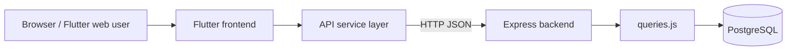
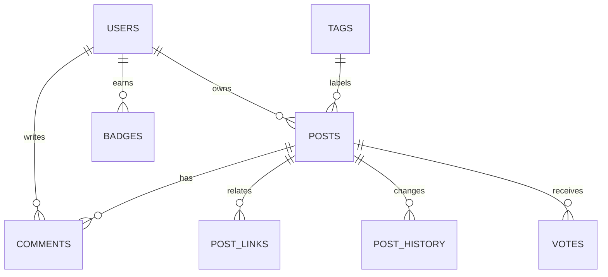

# Student Message Board

A StackOverflow-style student question-and-answer board with a Flutter frontend, Node.js/Express backend, and PostgreSQL database. Users can search posts, filter by tags/users, create and edit posts/comments, and view user-specific activity.

## System Diagram



## Data Model



## Repository Layout

| Path | Purpose |
| --- | --- |
| `src/backend/` | Express server and PostgreSQL query handlers. |
| `src/frontend/` | Flutter frontend source. |
| `src/database/` | PostgreSQL DDL. |
| `docs/` | SRS and project documentation. |

## Backend Setup

Create the PostgreSQL database and apply `src/database/postgresql_ddl.sql`. Then update database credentials in `src/backend/queries.js`.

```bash
cd student-message-board/src/backend
npm install
node index.js
```

The backend listens on port `3000`.

## Frontend Setup

Open `src/frontend/lib/main.dart` in a Flutter-enabled editor and run the web target, or use the Flutter CLI from `src/frontend` if the project metadata is present in your local copy.

## API Summary

| Method | Path | Purpose |
| --- | --- | --- |
| `POST` | `/users/login` | Username/password-style login check. |
| `GET` | `/users` and `/users/:id` | List or fetch users. |
| `GET` | `/post/:id` | Fetch a post. |
| `GET` | `/post/:id/comments` | Fetch comments for a post. |
| `POST` | `/postsearch` | Search posts by tags, user, sorting, and pagination. |
| `POST` | `/tagsearch` | Autocomplete tags. |
| `POST` | `/usersearch` | Autocomplete users. |
| `PUT` | `/updatepost` | Create or update a post. |
| `PUT` | `/updatecomment` | Create or update a comment. |

## Notes

- The current backend uses hard-coded local database credentials. Move those values into environment variables before deploying.
- `getAllQuestions` currently builds part of its SQL dynamically; parameterize it before using this in a production environment.
